# AWS Resource Dashboard

{: .fs-9 }

A Flask-based web application that provides a real-time dashboard for viewing AWS resources in your account.
{: .fs-6 .fw-300 }

[Get Started Now](#quick-start){: .btn .btn-primary .fs-5 .mb-4 .mb-md-0 .mr-2 }
[View on GitHub](https://github.com/MaorIdi/rolling_project){: .btn .fs-5 .mb-4 .mb-md-0 }

---

## What is This Project?

This project is a **complete DevOps learning playground** that demonstrates how to:

1. **Build** a Python Flask web application that connects to AWS
2. **Containerize** the application using Docker
3. **Provision infrastructure** using Terraform (Infrastructure as Code)
4. **Automate deployment** using Jenkins CI/CD pipelines

{: .highlight }

> **Perfect for Juniors!** This documentation explains everything step-by-step. No prior DevOps experience required!

---

## What Does the Application Do?

The AWS Resource Dashboard is a simple web application that:

| Feature             | Description                                                                              |
| :------------------ | :--------------------------------------------------------------------------------------- |
| **EC2 Instances**   | Shows all your EC2 instances with their ID, state (running/stopped), type, and public IP |
| **VPC Information** | Lists all your Virtual Private Clouds with their CIDR blocks                             |
| **Load Balancers**  | Displays all Application/Network Load Balancers and their DNS names                      |
| **AMI Images**      | Shows all custom AMIs (Amazon Machine Images) you own                                    |

When you run the application and open it in your browser, you'll see a dashboard that looks like this:

```
+------------------+----------+-----------+---------------+
| EC2 Instance ID  | State    | Type      | Public IP     |
+------------------+----------+-----------+---------------+
| i-0abc123def456  | running  | t3.medium | 54.123.45.67  |
| i-0xyz789ghi012  | stopped  | t2.micro  | N/A           |
+------------------+----------+-----------+---------------+
```

---

## Project Architecture

```mermaid
flowchart TB
    subgraph Developer["👨‍💻 Developer Machine"]
        Code[Python Code]
        Dockerfile[Dockerfile]
        Terraform[Terraform Files]
    end

    subgraph GitHub["📦 GitHub Repository"]
        Repo[Source Code]
    end

    subgraph Jenkins["🔄 Jenkins CI/CD"]
        Clone[Clone Repo]
        Lint[Lint Code]
        Scan[Security Scan]
        Build[Build Docker Image]
        Push[Push to Docker Hub]
    end

    subgraph DockerHub["🐳 Docker Hub"]
        Image[Docker Image]
    end

    subgraph AWS["☁️ AWS Cloud"]
        EC2[EC2 Instance]
        VPC[VPC]
        ELB[Load Balancer]
        AMI[AMI]
    end

    Code --> Repo
    Dockerfile --> Repo
    Terraform --> Repo
    Repo --> Clone
    Clone --> Lint
    Lint --> Scan
    Scan --> Build
    Build --> Push
    Push --> Image
    Image --> EC2
    EC2 --> VPC
    EC2 --> ELB
    EC2 --> AMI
```



---

## Technologies Used

This project uses several technologies. Don't worry if you don't know all of them - we'll explain each one!

### Programming & Frameworks

| Technology      | What It Is                     | Why We Use It                               |
| :-------------- | :----------------------------- | :------------------------------------------ |
| **Python 3.11** | A popular programming language | Easy to read and write, great for beginners |
| **Flask**       | A Python web framework         | Makes building web apps simple and fast     |
| **Boto3**       | AWS SDK for Python             | Lets Python talk to AWS services            |

### Infrastructure & DevOps

| Technology    | What It Is                  | Why We Use It                                   |
| :------------ | :-------------------------- | :---------------------------------------------- |
| **Docker**    | Container platform          | Packages our app so it runs the same everywhere |
| **Terraform** | Infrastructure as Code tool | Creates AWS resources automatically             |
| **Jenkins**   | CI/CD automation server     | Automatically builds and deploys our code       |

### AWS Services

| Service | What It Is                     | How We Use It                  |
| :------ | :----------------------------- | :----------------------------- |
| **EC2** | Virtual servers in the cloud   | Runs our application           |
| **VPC** | Virtual network in AWS         | Isolates our resources         |
| **ELB** | Load Balancer                  | Distributes traffic (optional) |
| **IAM** | Identity and Access Management | Controls who can do what       |

---

## Quick Start

Follow these steps to get the application running:

### Step 1: Clone the Repository

```bash
# Open your terminal and run:
git clone https://github.com/MaorIdi/rolling_project.git

# Navigate into the project folder:
cd rolling_project
```

{: .note }

> **What is cloning?** Cloning downloads a copy of the project from GitHub to your computer.

### Step 2: Set Up AWS Credentials

Before the app can read your AWS resources, it needs permission. Set these environment variables:

```bash
# On Linux/Mac:
export AWS_ACCESS_KEY_ID="your-access-key-id-here"
export AWS_SECRET_ACCESS_KEY="your-secret-access-key-here"
export AWS_REGION="us-east-1"

# On Windows (Command Prompt):
set AWS_ACCESS_KEY_ID=your-access-key-id-here
set AWS_SECRET_ACCESS_KEY=your-secret-access-key-here
set AWS_REGION=us-east-1

# On Windows (PowerShell):
$env:AWS_ACCESS_KEY_ID="your-access-key-id-here"
$env:AWS_SECRET_ACCESS_KEY="your-secret-access-key-here"
$env:AWS_REGION="us-east-1"
```

{: .warning }

> **Never commit your AWS credentials to Git!** These are secret keys that give access to your AWS account.

### Step 3: Run the Application

You have three options:

#### Option A: Run Directly with Python

```bash
# Navigate to the python folder
cd python

# Install dependencies
pip install -r requirements.txt

# Run the application
python app.py
```

#### Option B: Run with Docker

```bash
# Build the Docker image
docker build -t flask-aws-monitor .

# Run the container
docker run -d -p 5001:5001 \
  -e AWS_ACCESS_KEY_ID="your-key" \
  -e AWS_SECRET_ACCESS_KEY="your-secret" \
  -e AWS_REGION="us-east-1" \
  flask-aws-monitor
```

#### Option C: Use Pre-built Image from Docker Hub

```bash
docker run -d -p 5001:5001 \
  -e AWS_ACCESS_KEY_ID="your-key" \
  -e AWS_SECRET_ACCESS_KEY="your-secret" \
  -e AWS_REGION="us-east-1" \
  maoridi/rolling-project:latest
```

### Step 4: Open the Dashboard

Open your web browser and go to:

```
http://localhost:5001
```

🎉 **Congratulations!** You should now see your AWS resources displayed!

---

## Project Structure Explained

Here's what each file and folder does:

```
rolling_project/
│
├── 📁 aws/                    # Documentation and screenshots
│
├── 📁 docs/                   # This documentation website!
│   ├── _config.yml           # Jekyll configuration
│   ├── index.md              # Main page (you're reading it!)
│   ├── getting-started.md    # Detailed setup guide
│   ├── docker.md             # Docker guide
│   ├── terraform.md          # Terraform guide
│   ├── jenkins.md            # Jenkins CI/CD guide
│   └── troubleshooting.md    # Common problems & solutions
│
├── 📁 python/                 # The Flask application
│   ├── app.py                # Main application code
│   └── requirements.txt      # Python package dependencies
│
├── 📁 terraform/              # Infrastructure as Code
│   ├── main.tf               # Main infrastructure definition
│   ├── variables.tf          # Configurable variables
│   ├── outputs.tf            # Output values after creation
│   └── provider.tf           # AWS provider configuration
│
├── 📄 Dockerfile              # Instructions to build Docker image
├── 📄 Jenkinsfile             # CI/CD pipeline definition
└── 📄 README.md               # Project overview
```

---

## Understanding the Code

### The Flask Application (app.py)

Here's what the main application does, explained simply:

```python
# 1. Import necessary libraries
import boto3      # AWS SDK - lets us talk to AWS
from flask import Flask  # Web framework

# 2. Create the Flask app
app = Flask(__name__)

# 3. Connect to AWS using credentials from environment variables
session = boto3.Session(
    aws_access_key_id=os.getenv("AWS_ACCESS_KEY_ID"),
    aws_secret_access_key=os.getenv("AWS_SECRET_ACCESS_KEY"),
    region_name=os.getenv("AWS_REGION")
)

# 4. Create clients to talk to EC2 and ELB services
ec2_client = session.client("ec2")   # For EC2, VPC, AMI
elb_client = session.client("elbv2") # For Load Balancers

# 5. When someone visits the website, fetch data and show it
@app.route("/")
def home():
    # Get EC2 instances
    instances = ec2_client.describe_instances()

    # Get VPCs
    vpcs = ec2_client.describe_vpcs()

    # Get Load Balancers
    lbs = elb_client.describe_load_balancers()

    # Get AMIs
    amis = ec2_client.describe_images(Owners=["self"])

    # Display everything in HTML tables
    return render_template_string(html_template, ...)
```

---

## Next Steps

Now that you understand the basics, dive deeper into each component:

| Guide                                   | What You'll Learn                 |
| :-------------------------------------- | :-------------------------------- |
| [Getting Started](getting-started.html) | Detailed setup with prerequisites |
| [Docker Guide](docker.html)             | How containerization works        |
| [Terraform Guide](terraform.html)       | Infrastructure as Code explained  |
| [Jenkins Guide](jenkins.html)           | CI/CD pipeline setup              |
| [Troubleshooting](troubleshooting.html) | Solutions to common problems      |

---

## Need Help?

{: .highlight }

> **Stuck?** Don't worry! Check the [Troubleshooting Guide](troubleshooting.html) or open an issue on GitHub.

### Useful Resources for Learning

- [Python Official Tutorial](https://docs.python.org/3/tutorial/)
- [Flask Documentation](https://flask.palletsprojects.com/)
- [Docker Getting Started](https://docs.docker.com/get-started/)
- [Terraform Tutorials](https://learn.hashicorp.com/terraform)
- [AWS Free Tier](https://aws.amazon.com/free/) - Practice for free!

---

## Contributing

Found a bug? Want to improve the documentation?

1. Fork the repository
2. Create a new branch
3. Make your changes
4. Submit a Pull Request

All contributions are welcome! 🙌
