# Jenkins CI/CD Guide

{: .fs-9 }

Learn how to set up Jenkins for automated building, testing, and deploying.
{: .fs-6 .fw-300 }

---

## Table of Contents

{: .no_toc .text-delta }

1. TOC
   {:toc}

---

## What is CI/CD?

**CI/CD** stands for Continuous Integration / Continuous Deployment:

| Term                            | What It Means                                             | Example                             |
| :------------------------------ | :-------------------------------------------------------- | :---------------------------------- |
| **Continuous Integration (CI)** | Automatically build and test code when changes are pushed | Every git push triggers tests       |
| **Continuous Deployment (CD)**  | Automatically deploy tested code to production            | After tests pass, deploy to servers |

### Why Use CI/CD?

| Benefit         | Without CI/CD             | With CI/CD                 |
| :-------------- | :------------------------ | :------------------------- |
| **Building**    | Manual: `docker build...` | Automatic on every push    |
| **Testing**     | Forget to run tests       | Tests run automatically    |
| **Security**    | Skip security scans       | Security scans every time  |
| **Deployment**  | Manual uploads            | Auto-deploy after approval |
| **Consistency** | "Works on my machine"     | Same process every time    |

{: .highlight }

> **Think of CI/CD like an assembly line in a factory** - once set up, it automatically transforms raw materials (code) into finished products (deployed apps) with quality checks at each step.

---

## What is Jenkins?

Jenkins is an open-source automation server. It:

- Watches your GitHub repository for changes
- Runs your pipeline (build, test, deploy steps)
- Reports success or failure
- Can be extended with plugins

---

## Our Pipeline Overview

Here's what our Jenkins pipeline does:

```mermaid
flowchart LR
    A[📥 Clone<br/>Repository] --> B[🔍 Parallel Checks]

    subgraph B[" "]
        B1[Linting<br/>Flake8 + Hadolint]
        B2[Security<br/>Bandit + Trivy]
    end

    B --> C[🏗️ Build<br/>Docker Image]
    C --> D[📤 Push to<br/>Docker Hub]

    style A fill:#e1f5fe
    style C fill:#fff3e0
    style D fill:#e8f5e9
```



### Pipeline Stages Explained

| Stage                  | What Happens                      | Tools Used                             |
| :--------------------- | :-------------------------------- | :------------------------------------- |
| **Clone Repository**   | Downloads latest code from GitHub | Git                                    |
| **Linting**            | Checks code quality and style     | Flake8 (Python), Hadolint (Dockerfile) |
| **Security Scan**      | Looks for vulnerabilities         | Bandit (Python), Trivy (filesystem)    |
| **Build Docker Image** | Creates the Docker image          | Docker                                 |
| **Push to Docker Hub** | Uploads image to registry         | Docker                                 |

---

## Understanding the Jenkinsfile

Let's break down our `Jenkinsfile` section by section:

### Pipeline Structure

```groovy
pipeline {
    agent any  // Run on any available Jenkins agent

    environment {
        // Variables available throughout the pipeline
    }

    stages {
        // The steps to execute
    }

    post {
        // Actions after pipeline completes
    }
}
```

### Environment Variables

```groovy
environment {
    DOCKERHUB_USERNAME = credentials('dockerhub-username')
    DOCKERHUB_PASSWORD = credentials('dockerhub-password')
    IMAGE_NAME = "${DOCKERHUB_USERNAME}/rolling-project"
}
```

**What this does:**

- `credentials('id')` - Securely retrieves stored credentials from Jenkins
- `IMAGE_NAME` - Constructs the full image name like `maoridi/rolling-project`

{: .important }

> **Never put credentials directly in Jenkinsfile!** Always use Jenkins credentials store.

### Stage 1: Clone Repository

```groovy
stage('Clone Repository') {
    steps {
        git branch: 'main', url: 'https://github.com/MaorIdi/rolling_project.git'
    }
}
```

**What this does:**

- Clones the `main` branch from GitHub
- Makes code available for subsequent stages

### Stage 2: Parallel Checks

```groovy
stage('Parallel Checks') {
    parallel {
        stage('Linting') {
            steps {
                echo 'Running Flake8 linting...'
                sh '''
                    docker run --rm -v "${WORKSPACE}":/app -w /app python:3.11-slim \
                    sh -c "pip install flake8 --quiet && flake8 python/ --max-line-length=120" || true
                '''

                echo 'Running Hadolint for Dockerfile...'
                sh '''
                    docker run --rm -i hadolint/hadolint < Dockerfile || true
                '''
            }
        }
        stage('Security Scan') {
            steps {
                echo 'Running Bandit for Python security...'
                sh '''
                    docker run --rm -v "${WORKSPACE}":/app -w /app python:3.11-slim \
                    sh -c "pip install bandit --quiet && bandit -r python/ -f txt" || true
                '''

                echo 'Running Trivy security scan...'
                sh '''
                    docker run --rm -v "${WORKSPACE}":/app aquasec/trivy:latest \
                    fs --severity HIGH,CRITICAL --exit-code 0 /app
                '''
            }
        }
    }
}
```

**What this does:**

**Linting (Code Quality):**

- **Flake8**: Checks Python code follows style guidelines
- **Hadolint**: Checks Dockerfile best practices

**Security Scanning:**

- **Bandit**: Scans Python code for security issues
- **Trivy**: Scans for vulnerabilities in dependencies

{: .note }

> **`|| true`** at the end means "continue even if this fails". This prevents the pipeline from stopping on warnings.

### Stage 3: Build Docker Image

```groovy
stage('Build Docker Image') {
    steps {
        sh '''
            docker build -t ${IMAGE_NAME}:${BUILD_NUMBER} -t ${IMAGE_NAME}:latest .
        '''
    }
}
```

**What this does:**

- Builds the Docker image with two tags:
  - `rolling-project:123` (build number for versioning)
  - `rolling-project:latest` (always points to newest)

### Stage 4: Push to Docker Hub

```groovy
stage('Push to Docker Hub') {
    steps {
        sh '''
            echo ${DOCKERHUB_PASSWORD} | docker login -u ${DOCKERHUB_USERNAME} --password-stdin
            docker push ${IMAGE_NAME}:${BUILD_NUMBER}
            docker push ${IMAGE_NAME}:latest
        '''
    }
}
```

**What this does:**

1. Logs into Docker Hub securely
2. Pushes both tagged versions
3. Images are now available for anyone to pull

### Post Actions

```groovy
post {
    always {
        sh 'docker logout || true'
    }
    success {
        echo 'Pipeline completed successfully!'
        echo "Docker image pushed: ${IMAGE_NAME}:${BUILD_NUMBER}"
    }
    failure {
        echo 'Pipeline failed! Check the logs for details.'
    }
}
```

**What this does:**

- `always`: Runs regardless of success/failure (logout)
- `success`: Only runs if pipeline succeeds
- `failure`: Only runs if pipeline fails

---

## Setting Up Jenkins

### Step 1: Install Jenkins on EC2

SSH into your EC2 instance (created with Terraform):

```bash
ssh -i builder_key.pem ec2-user@your-ec2-ip
```

Install Jenkins:

```bash
# Update system
sudo yum update -y

# Add Jenkins repository
sudo wget -O /etc/yum.repos.d/jenkins.repo \
    https://pkg.jenkins.io/redhat-stable/jenkins.repo
sudo rpm --import https://pkg.jenkins.io/redhat-stable/jenkins.io-2023.key

# Install Java (required for Jenkins)
sudo yum install java-17-amazon-corretto -y

# Install Jenkins
sudo yum install jenkins -y

# Start Jenkins
sudo systemctl start jenkins
sudo systemctl enable jenkins

# Get initial admin password
sudo cat /var/lib/jenkins/secrets/initialAdminPassword
```

### Step 2: Install Docker on EC2

```bash
# Install Docker
sudo yum install docker -y

# Start Docker
sudo systemctl start docker
sudo systemctl enable docker

# Add Jenkins user to Docker group
sudo usermod -aG docker jenkins

# Restart Jenkins to pick up group change
sudo systemctl restart jenkins
```

### Step 3: Access Jenkins

1. Open your browser: `http://your-ec2-ip:8080`
2. Enter the initial admin password from Step 1
3. Install suggested plugins
4. Create admin user
5. Complete setup

### Step 4: Configure Credentials

1. Go to **Manage Jenkins** → **Credentials**
2. Click **System** → **Global credentials**
3. Click **Add Credentials**

Add these credentials:

**Docker Hub Username:**

- **Kind**: Secret text
- **Secret**: Your Docker Hub username
- **ID**: `dockerhub-username`

**Docker Hub Password:**

- **Kind**: Secret text
- **Secret**: Your Docker Hub password or access token
- **ID**: `dockerhub-password`

{: .important }

> **Use Docker Hub Access Token instead of password!** Go to Docker Hub → Account Settings → Security → New Access Token

### Step 5: Create Pipeline Job

1. Click **New Item**
2. Enter name: `aws-dashboard-pipeline`
3. Select **Pipeline**
4. Click **OK**

Configure the pipeline:

**General:**

- Check "GitHub project"
- Project url: `https://github.com/MaorIdi/rolling_project/`

**Build Triggers:**

- Check "GitHub hook trigger for GITScm polling" (optional, for auto-builds)

**Pipeline:**

- Definition: **Pipeline script from SCM**
- SCM: **Git**
- Repository URL: `https://github.com/MaorIdi/rolling_project.git`
- Branch: `*/main`
- Script Path: `Jenkinsfile`

Click **Save**.

### Step 6: Run the Pipeline

1. Click **Build Now**
2. Watch the pipeline execute
3. Click on the build number to see details
4. Check **Console Output** for logs

---

## Understanding Pipeline Output

### Successful Build

```
Started by user admin
...
[Pipeline] stage
[Pipeline] { (Clone Repository)
...
[Pipeline] { (Build Docker Image)
+ docker build -t maoridi/rolling-project:1 -t maoridi/rolling-project:latest .
...
[Pipeline] { (Push to Docker Hub)
+ docker push maoridi/rolling-project:1
...
Finished: SUCCESS
```

### Failed Build

```
[Pipeline] { (Linting)
python/app.py:45:80: E501 line too long (120 > 79 characters)
...
Finished: FAILURE
```

---

## CI/CD Tools Explained

### Flake8 (Python Linter)

**What it checks:**

- Code style (PEP 8 compliance)
- Syntax errors
- Undefined variables
- Unused imports

**Example output:**

```
python/app.py:10:1: E302 expected 2 blank lines, found 1
python/app.py:25:80: E501 line too long (95 > 79 characters)
```

### Hadolint (Dockerfile Linter)

**What it checks:**

- Dockerfile best practices
- Security issues
- Efficient layering

**Example output:**

```
Dockerfile:3 DL3013 Pin versions in pip
Dockerfile:8 DL3025 Use arguments JSON notation for CMD
```

### Bandit (Security Scanner for Python)

**What it checks:**

- Hardcoded passwords
- SQL injection vulnerabilities
- Shell injection risks
- Use of unsafe functions

**Example output:**

```
>> Issue: Possible hardcoded password: 'secret123'
   Severity: Low   Confidence: Medium
   Location: app.py:15
```

### Trivy (Vulnerability Scanner)

**What it checks:**

- Known vulnerabilities in dependencies
- OS package vulnerabilities
- Misconfigurations

**Example output:**

```
python (python-pkg)
Total: 2 (HIGH: 1, CRITICAL: 1)

┌──────────┬────────────────┬──────────┬───────────────────┐
│ Library  │ Vulnerability  │ Severity │ Installed Version │
├──────────┼────────────────┼──────────┼───────────────────┤
│ requests │ CVE-2023-XXXXX │ HIGH     │ 2.25.0            │
└──────────┴────────────────┴──────────┴───────────────────┘
```

---

## Pipeline Flow Diagram


---

## Automatic Builds (GitHub Webhook)

To trigger builds automatically when you push code:

### Step 1: Configure GitHub Webhook

1. Go to your GitHub repository
2. Click **Settings** → **Webhooks**
3. Click **Add webhook**
4. Configure:
   - **Payload URL**: `http://your-ec2-ip:8080/github-webhook/`
   - **Content type**: `application/json`
   - **Events**: Just the push event
5. Click **Add webhook**

### Step 2: Verify Webhook

1. Push a commit to your repository
2. Check GitHub webhook delivery status
3. Watch Jenkins start a new build automatically

{: .note }

> **Webhook not working?** Make sure your EC2 security group allows inbound traffic on port 8080 from GitHub's IP addresses.

---

## Common Pipeline Customizations

### Add Email Notifications

```groovy
post {
    failure {
        mail to: 'your-email@example.com',
             subject: "Build Failed: ${currentBuild.fullDisplayName}",
             body: "Check console output at ${BUILD_URL}"
    }
}
```

### Add Slack Notifications

```groovy
post {
    success {
        slackSend channel: '#builds',
                  color: 'good',
                  message: "Build Succeeded: ${env.JOB_NAME} #${env.BUILD_NUMBER}"
    }
}
```

### Deploy to EC2

```groovy
stage('Deploy') {
    steps {
        sh '''
            ssh -i key.pem ec2-user@production-server \
            "docker pull ${IMAGE_NAME}:latest && \
             docker stop app || true && \
             docker rm app || true && \
             docker run -d --name app -p 5001:5001 ${IMAGE_NAME}:latest"
        '''
    }
}
```

---

## Troubleshooting Jenkins

### Pipeline Stuck on Docker Commands

**Problem:** Jenkins can't access Docker

**Solution:**

```bash
# Add jenkins to docker group
sudo usermod -aG docker jenkins

# Restart Jenkins
sudo systemctl restart jenkins
```

### Credentials Not Found

**Problem:** `CredentialNotFoundException`

**Solution:** Verify credential IDs match exactly:

- Check **Manage Jenkins** → **Credentials**
- ID must be `dockerhub-username` (not `DockerHub-Username`)

### Out of Disk Space

**Problem:** Build fails with disk space error

**Solution:**

```bash
# Clean up Docker
docker system prune -a

# Clean up Jenkins builds
# Manage Jenkins → Manage Old Data
```

### GitHub Webhook Not Triggering

**Problem:** Builds don't start on push

**Solution:**

1. Check webhook delivery in GitHub (Settings → Webhooks)
2. Verify security group allows port 8080
3. Check Jenkins logs: `sudo tail -f /var/log/jenkins/jenkins.log`

---

## Security Best Practices

| Practice              | Why It Matters                          |
| :-------------------- | :-------------------------------------- |
| Use credentials store | Never expose secrets in Jenkinsfile     |
| Use access tokens     | Don't use actual passwords              |
| Limit permissions     | Jenkins user needs only required access |
| Update regularly      | Keep Jenkins and plugins updated        |
| Audit builds          | Review who ran what pipelines           |

---

## Next Steps

- [Troubleshooting Guide](troubleshooting.html) - Fix common issues
- Explore Jenkins plugins for more features
- Consider Jenkins in Docker for easier management
