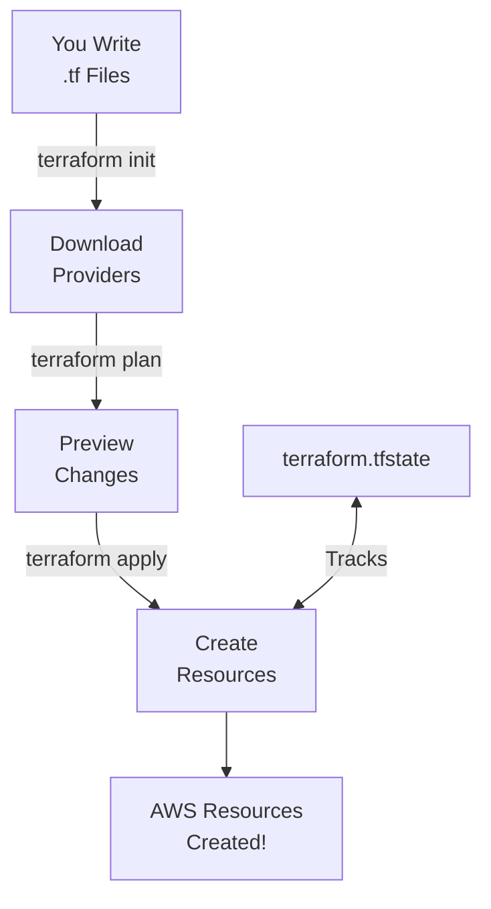
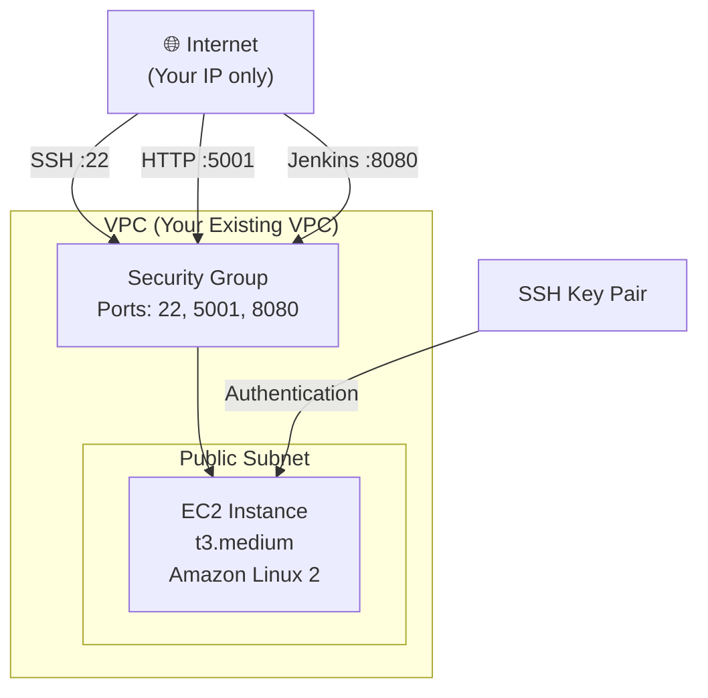

# Terraform Guide

{: .fs-9 }

Learn how to use Terraform to automatically provision AWS infrastructure.
{: .fs-6 .fw-300 }

---

## Table of Contents

{: .no_toc .text-delta }

1. TOC
   {:toc}

---

## What is Terraform?

Terraform is an **Infrastructure as Code (IaC)** tool that lets you define your infrastructure in configuration files instead of clicking through the AWS Console.

### Why Use Terraform?

| Benefit                | Explanation                                          |
| :--------------------- | :--------------------------------------------------- |
| **Reproducible**       | Run the same code to create identical infrastructure |
| **Version Controlled** | Track changes to infrastructure in Git               |
| **Automated**          | No manual clicking - just run commands               |
| **Documentation**      | The code itself documents your infrastructure        |
| **Shareable**          | Team members can review and understand setup         |

{: .highlight }

> **Think of it like this**: Instead of taking notes on how to set up AWS, you write code that does it for you. Run the code once, and your infrastructure appears. Delete it and recreate it identically anytime.

---

## Terraform Concepts for Beginners

### Key Terms

| Term         | Definition                                  | Example                      |
| :----------- | :------------------------------------------ | :--------------------------- |
| **Provider** | Plugin that connects Terraform to a service | AWS, Google Cloud, Azure     |
| **Resource** | A piece of infrastructure to create         | EC2 instance, Security Group |
| **Variable** | Configurable input values                   | Instance type, region        |
| **Output**   | Values exported after creation              | IP address, DNS name         |
| **State**    | Terraform's record of what it created       | `terraform.tfstate` file     |

### How Terraform Works



1. **Write** configuration files (`.tf`)
2. **Init** downloads required providers
3. **Plan** shows what will be created
4. **Apply** creates the resources
5. **State** file tracks what was created

---

## Project Terraform Files Explained

Our project has these Terraform files:

```
terraform/
├── main.tf        # Main infrastructure definition
├── variables.tf   # Input variables
├── outputs.tf     # Output values
├── provider.tf    # AWS provider configuration
└── terraform.tfstate  # State file (auto-generated)
```

### provider.tf - AWS Provider Configuration

```hcl
# Tell Terraform we're using AWS
terraform {
  required_providers {
    aws = {
      source  = "hashicorp/aws"
      version = "~> 5.0"
    }
  }
}

# Configure the AWS provider
provider "aws" {
  region = var.aws_region
}
```

**What this does:**

- Tells Terraform to use the AWS provider
- Sets the AWS region from a variable

### variables.tf - Input Variables

```hcl
variable "vpc_id" {
  description = "Existing VPC ID to deploy into"
  type        = string
  default     = "vpc-057d47ed8fe79738e"
}

variable "ami_id" {
  description = "Linux AMI that supports Docker (e.g., Amazon Linux 2)"
  type        = string
  default     = "ami-0c398cb65a93047f2"
}

variable "instance_type" {
  description = "Instance type to support Docker workloads"
  type        = string
  default     = "t3.medium"
}

variable "my_ip" {
  description = "Your public IP for SSH and HTTP access"
  type        = string
  default     = "146.185.57.74/32"
}

variable "public_subnet_id" {
  description = "Public subnet ID to launch the EC2 instance into"
  type        = string
  default     = "subnet-05f36bfd3e6a5672f"
}
```

{: .important }

> **You MUST update these values** for your own AWS account! The defaults are example values that won't work for you.

### main.tf - Infrastructure Definition

Let's break down each section:

#### SSH Key Generation

{: .no_toc }

```hcl
# Generate an SSH key pair
resource "tls_private_key" "ssh_key" {
  algorithm = "RSA"
  rsa_bits  = 4096
}

# Save the private key locally
resource "local_file" "private_key" {
  content         = tls_private_key.ssh_key.private_key_pem
  filename        = "${path.module}/builder_key.pem"
  file_permission = "0600"
}

# Create AWS key pair with the public key
resource "aws_key_pair" "builder_key" {
  key_name   = "builder_key"
  public_key = tls_private_key.ssh_key.public_key_openssh
}
```

**What this does:**

1. Generates a 4096-bit RSA key pair
2. Saves the private key to `builder_key.pem`
3. Uploads the public key to AWS

#### Security Group

{: .no_toc }

```hcl
resource "aws_security_group" "builder_sg" {
  name        = "maor-sg-builder"
  description = "Security group for builder instance"
  vpc_id      = var.vpc_id

  # Allow SSH (port 22) from your IP
  ingress {
    description = "SSH Access"
    from_port   = 22
    to_port     = 22
    protocol    = "tcp"
    cidr_blocks = [var.my_ip]
  }

  # Allow app access (port 5001) from your IP
  ingress {
    description = "HTTP Access for Python app"
    from_port   = 5001
    to_port     = 5001
    protocol    = "tcp"
    cidr_blocks = [var.my_ip]
  }

  # Allow Jenkins (port 8080) from your IP
  ingress {
    description = "Port 8080"
    from_port   = 8080
    to_port     = 8080
    protocol    = "tcp"
    cidr_blocks = [var.my_ip]
  }

  # Allow all outbound traffic
  egress {
    description = "Allow all outbound traffic"
    from_port   = 0
    to_port     = 0
    protocol    = "-1"
    cidr_blocks = ["0.0.0.0/0"]
  }

  tags = {
    Name = "builder-sg"
  }
}
```

**What this does:**

- Creates a firewall with rules for SSH, app, and Jenkins
- Only allows access from YOUR IP address (security!)
- Allows all outbound traffic (for downloading packages)

#### EC2 Instance

{: .no_toc }

```hcl
resource "aws_instance" "builder" {
  ami                         = var.ami_id
  instance_type               = var.instance_type
  subnet_id                   = var.public_subnet_id
  vpc_security_group_ids      = [aws_security_group.builder_sg.id]
  key_name                    = aws_key_pair.builder_key.key_name
  associate_public_ip_address = true

  tags = {
    Name = "builder"
  }
}
```

**What this does:**

- Creates an EC2 instance
- Uses the specified AMI and instance type
- Attaches the security group
- Assigns a public IP address

### outputs.tf - Output Values

```hcl
output "builder_public_ip" {
  description = "Public IP of the EC2 instance"
  value       = aws_instance.builder.public_ip
}

output "ssh_private_key_path" {
  description = "Path to the generated private SSH key"
  value       = local_file.private_key.filename
  sensitive   = true
}

output "ssh_key_name" {
  description = "Name of the AWS SSH key pair"
  value       = aws_key_pair.builder_key.key_name
}

output "security_group_id" {
  description = "Security Group ID for the builder instance"
  value       = aws_security_group.builder_sg.id
}
```

**What this does:**

- Shows important values after creation
- Makes it easy to find the IP address to connect

---

## Step-by-Step: Using Terraform

### Step 1: Install Terraform

**Windows (Chocolatey)**

```bash
choco install terraform
```

**macOS (Homebrew)**

```bash
brew install terraform
```

**Linux**

```bash
# Download
wget https://releases.hashicorp.com/terraform/1.6.0/terraform_1.6.0_linux_amd64.zip

# Unzip
unzip terraform_1.6.0_linux_amd64.zip

# Move to PATH
sudo mv terraform /usr/local/bin/
```

**Verify installation:**

```bash
terraform --version
# Terraform v1.6.x
```

### Step 2: Configure Variables

Navigate to the terraform folder and update `variables.tf`:

```bash
cd terraform
```

**You MUST update these values:**

| Variable           | How to Find It                            |
| :----------------- | :---------------------------------------- |
| `vpc_id`           | AWS Console → VPC → Your VPCs → VPC ID    |
| `public_subnet_id` | AWS Console → VPC → Subnets → Subnet ID   |
| `my_ip`            | Run `curl ifconfig.me` and add `/32`      |
| `ami_id`           | AWS Console → EC2 → AMIs → Amazon Linux 2 |

{: .note }

> **Finding your IP**: Open terminal and run `curl ifconfig.me`. If it shows `203.0.113.45`, use `203.0.113.45/32` in variables.tf.

### Step 3: Initialize Terraform

```bash
terraform init
```

Output:

```
Initializing the backend...
Initializing provider plugins...
- Finding hashicorp/aws versions matching "~> 5.0"...
- Installing hashicorp/aws v5.31.0...

Terraform has been successfully initialized!
```

**What this does:**

- Downloads the AWS provider plugin
- Creates `.terraform` directory
- Prepares Terraform to work with AWS

### Step 4: Preview Changes (Plan)

```bash
terraform plan
```

This shows what Terraform will create WITHOUT actually creating it:

```
Terraform will perform the following actions:

  # aws_instance.builder will be created
  + resource "aws_instance" "builder" {
      + ami                          = "ami-0c398cb65a93047f2"
      + instance_type                = "t3.medium"
      ...
    }

  # aws_key_pair.builder_key will be created
  ...

  # aws_security_group.builder_sg will be created
  ...

Plan: 4 to add, 0 to change, 0 to destroy.
```

{: .highlight }

> **Always run `terraform plan` first!** Review what will be created before applying.

### Step 5: Create Resources (Apply)

```bash
terraform apply
```

Terraform will show the plan again and ask for confirmation:

```
Do you want to perform these actions?
  Terraform will perform the actions described above.
  Only 'yes' will be accepted to approve.

  Enter a value: yes
```

Type `yes` and press Enter.

```
aws_key_pair.builder_key: Creating...
aws_security_group.builder_sg: Creating...
aws_key_pair.builder_key: Creation complete after 1s
aws_security_group.builder_sg: Creation complete after 3s
aws_instance.builder: Creating...
aws_instance.builder: Still creating... [10s elapsed]
aws_instance.builder: Creation complete after 33s

Apply complete! Resources: 4 added, 0 changed, 0 destroyed.

Outputs:

builder_public_ip = "54.123.45.67"
ssh_private_key_path = "builder_key.pem"
```

🎉 **Your infrastructure is created!**

### Step 6: Connect to Your Instance

```bash
# Make the key file secure (required by SSH)
chmod 400 builder_key.pem  # Linux/Mac
# Windows: Right-click → Properties → Security → Advanced

# Connect via SSH
ssh -i builder_key.pem ec2-user@54.123.45.67
```

Replace `54.123.45.67` with your actual IP from the outputs.

---

## Managing Infrastructure

### View Current State

```bash
# Show what Terraform manages
terraform show

# List all resources in state
terraform state list
```

### Make Changes

1. Edit your `.tf` files
2. Run `terraform plan` to see changes
3. Run `terraform apply` to apply changes

### Destroy Infrastructure

{: .warning }

> **Warning!** This deletes all resources Terraform created. Use with caution!

```bash
terraform destroy
```

---

## Understanding Terraform State

### What is State?

Terraform keeps a `terraform.tfstate` file that tracks:

- What resources it created
- Their current configuration
- IDs and other metadata

### State Best Practices

| Do                         | Don't                                  |
| :------------------------- | :------------------------------------- |
| Keep state file secure     | Share state file publicly              |
| Use remote state for teams | Edit state file manually               |
| Back up state regularly    | Delete state file (you'll lose track!) |

### Remote State (Team Use)

For team environments, store state in S3:

```hcl
terraform {
  backend "s3" {
    bucket = "my-terraform-state"
    key    = "rolling-project/terraform.tfstate"
    region = "us-east-1"
  }
}
```

---

## Common Terraform Commands

| Command              | Description                  |
| :------------------- | :--------------------------- |
| `terraform init`     | Initialize working directory |
| `terraform plan`     | Preview changes              |
| `terraform apply`    | Apply changes                |
| `terraform destroy`  | Destroy all resources        |
| `terraform show`     | Show current state           |
| `terraform fmt`      | Format .tf files nicely      |
| `terraform validate` | Check syntax                 |
| `terraform output`   | Show output values           |

---

## Architecture Diagram

What Terraform creates in this project:



---

## Customizing the Infrastructure

### Change Instance Type

Edit `variables.tf`:

```hcl
variable "instance_type" {
  default = "t3.large"  # Changed from t3.medium
}
```

### Add More Ports

Edit `main.tf` and add another ingress rule:

```hcl
ingress {
  description = "HTTPS"
  from_port   = 443
  to_port     = 443
  protocol    = "tcp"
  cidr_blocks = [var.my_ip]
}
```

### Add User Data (Auto-Configure Instance)

```hcl
resource "aws_instance" "builder" {
  # ... existing config ...

  user_data = <<-EOF
    #!/bin/bash
    yum update -y
    yum install -y docker
    systemctl start docker
    systemctl enable docker
    usermod -aG docker ec2-user
  EOF
}
```

---

## Troubleshooting Terraform

### Error: No Valid Credentials

```
Error: No valid credential sources found
```

**Solution:** Configure AWS credentials:

```bash
aws configure
```

### Error: VPC Not Found

```
Error: Error creating Security Group: VpcIdNotSpecified
```

**Solution:** Update `vpc_id` in `variables.tf` with a valid VPC from your account.

### Error: Subnet Not Found

```
Error: InvalidSubnetID.NotFound
```

**Solution:** Update `public_subnet_id` in `variables.tf` with a valid subnet.

### Error: AMI Not Found

```
Error: InvalidAMIID.NotFound
```

**Solution:**

1. Go to AWS Console → EC2 → AMIs
2. Search for "Amazon Linux 2"
3. Copy the AMI ID for your region
4. Update `ami_id` in `variables.tf`

---

## Estimated Costs

{: .important }

> **Cost Awareness**: Running AWS resources costs money!

| Resource      | Cost (us-east-1)           |
| :------------ | :------------------------- |
| t3.medium EC2 | ~$0.0416/hour (~$30/month) |
| Public IP     | Free while attached        |
| Data Transfer | Varies                     |

**To avoid charges:**

- Stop instances when not using
- Run `terraform destroy` when done experimenting

---

## Next Steps

Now that your infrastructure is ready:

- [Jenkins Guide](jenkins.html) - Set up CI/CD on your EC2 instance
- [Troubleshooting](troubleshooting.html) - Fix common issues
